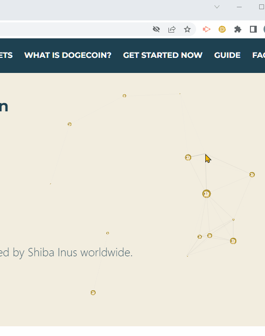

# DPal Wallet ==> A wallet only For Doge

## DEMO

## Install

## Description

A crypto wallet only for Doge Coin

A browser extension based wallet to interact with the Doge blockchain. User can tips and use Doge easily

Or DEV a "web3" app?

DPal store the private key in locally and won't record the private key in the server.

So your Doge is your Doge, but keep the phrase(12 words)/key safty in your own way it's necessary. You can use your own Phrase  
recovery the wallet at any time.

* user using dpal wallet is easy to tip to any one.
* For web stroe apps can throgh the injects API into every website's javascript context, so that make doge easily to buy things.
* [API and demo](./api.md)

## FAQ

- Why useable amount not eq balance of address ? 

  Because the UTXO of the change is not confirmed or the network delay
  
- Can the mnemonic be imported into other wallets for recovery?

  Yes,You can import into other wallets that support BIP39

- Can the account imported with the private key be recovered through the mnemonic phrase?

  No,you can't
 
 - Can I find a lost mnemonic?

  You can find the mnemonic in the show mnemonic page, But if you clear the computer data and no backup elsewhere, that means you can't find it back.

 - I have a large amount of DOGE, it is recommended to transfer to a cold wallet?
   
   yES,Although this wallet can store private keys, it is recommended to only store small amounts of DOGE for tips and spend 
   
## Contact Us

E-mails: mailto:dpalwallet@outlook.com

donate address : DEGzHPRaiFMhEip819w29iR6tTG8HajvAo

